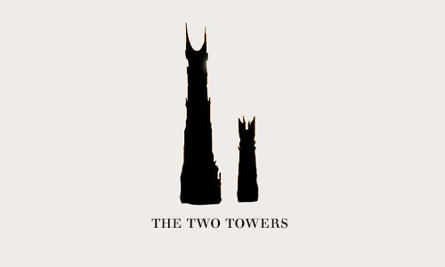

- title : And in the darkness bind them: A functional workflow to rule them all
- description : 
- author : Reid Evans
- theme : Simple 
- transition : Fade

***

### And in the darkness bind them
#### A functional workflow to rule them all
####[@ReidNEvans](http://twitter.com/reidnevans)
####http://reidevans.tech
####Founder of [@FunctionalKnox](http://twitter.com/functionalKnox)

***

***

***

* Functional Programming
* Higher Order Functions
* Algebraic Data Types
* Three types of functions*
* Putting it all together

***

## What is functional programming?

***

***

### Totality

Every element in the domain must be mapped to some element in the codomain 

***

### Determinism

Calling a function with the same value (in domain) results in same value (in codomain).

***
	
Javascript

	[lang=js]
	function greet(person) {
		return 'Hello, ' + person;
	}
	
***

Haskell

	[lang=haskell]
	timesTwo x = x * 2
	
	getFirst list = head list

***

## Higher Order Functions

Functions that accept or return another function

***

	var list = [1,2,3,4],
		result = [];
		
	for (var i = 0; i < list.length; i++) {
		if (list[i] % 2 === 0) {
			result.push(list[i] * 2);
		}
	}

***
	
    [1,2,3,4].filter(x => x % 2 == 0)
			 .map(x => x * 2)
			 
***
	
	const isEven = x => x % 2 == 0,
		  timesTwo = x => x * 2;
		
	[1,2,3,4].filter(isEven)
			 .map(timesTwo)
			 
	isEven(2)
	
	$.when(2).then(timesTwo)
	
***

## Algebraic Data Types

***

F#

    type Point = {
      X : double
	  Y : double
    }

    type Shape =
      | Circle of Point * double
      | Polygon of Point list

Haskell

	[lang=haskell]
	type Point = (Double,Double)

	data Shape 
		= Circle  Point Double
		| Polygon [Point]

***

## Contexts

***

* Promise
* Array
* Task
* Stream
* IO

***

F#

	type Either<'Left, 'Right> =
		| Left of 'Left
		| Right of 'Right

Haskell

	[lang=haskell]
	data Either a b
		= Left a
		| Right b

***

<section data-background="#5bc0de">

An exception is a kind of cascading goto

**The Pragmatic Programmer**
</section>

***

###[@ReidNEvans](http://twitter.com/reidnevans)

####http://reidevans.tech
####[@FunctionalKnox](http://twitter.com/functionalknox)

