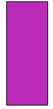
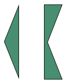
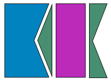
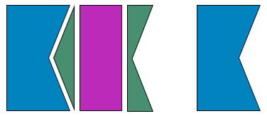
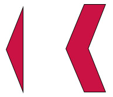
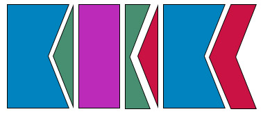
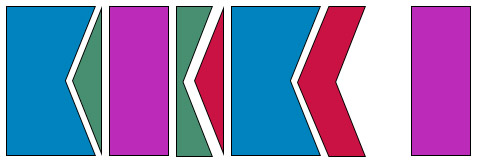
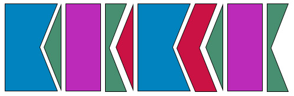

- title : And in the darkness bind them: A functional workflow to rule them all
- description : 
- author : Reid Evans
- theme : Simple 
- transition : Fade

***

### And in the darkness bind them
#### A functional workflow to rule them all
#### [@ReidNEvans](http://twitter.com/reidnevans)
#### http://reidevans.tech
#### Founder of [@FunctionalKnox](http://twitter.com/functionalKnox)

***

***

***

##1 data type
## +
##2 functions

***

All your wildest dreams will come true

***

## What is functional programming?

***

***

## Totality

Every element in the domain must be mapped to some element in the codomain 

***

## Determinism

Calling a function with the  same value (in domain) results in same value (in codomain).

***
F#

	let double x = x * 2
	
---
Javascript

	[lang=js]
	function greet(who) {
		console.log("hello " + who)
	}

---
F#

	let formatDate format =
		DateTime.Now.ToString(format)

---
C#

	[lang=cs]
	public string FormatDate(DateTime date, string format)
	{
		return date.ToString(format);
	}

---
F#

	let divide x y = x / y
	
---
F#

	let divide x y =
		if y = 0
		then None
		else Some (x / y)

---
Haskell

	[lang=haskell]
	head [1,2,3]
	1

---
Haskell

        head []
        *** Exception: Prelude.head: empty list
		
***

## Higher Order Functions

Functions that accept or return another function

***

***

	[lang=javascript]
	var list = [1,2,3,4],
        result = [];
		
	for (var i = 0; i < list.length; i++) {
		if (list[i] % 2 === 0) {
			result.push(list[i] * 2);
		}
	}

---

	[lang=javascript]
    [1,2,3,4].filter(x => x % 2 == 0)
             .map(x => x * 2)
			 
---

	[lang=javascript]
	const isEven = x => x % 2 == 0,
          timesTwo = x => x * 2;
		
	[1,2,3,4].filter(isEven)
             .map(timesTwo)
			 
---

	[lang=javascript]
    const isEven = x => x % 2 == 0,
          timesTwo = x => x * 2;

    [1,2,3,4].filter(isEven)
             .map(timesTwo)

	timesTwo(2)
	
	$.when(2)
	.then(timesTwo)
***

	[lang=javascript]
	const isAdmin = x => x.level > 9 && x.isActive;
	
	function getAdmins() {
		return $.getJson('/api/users')
				.done(data => data.filter(isAdmin))
	}

***

## The One Type

---
F#

	type Either<'Left, 'Right> =
		| Left of 'Left
		| Right of 'Right
		
---
Haskell

	[lang=haskell]
	data Either a b
		= Left a
		| Right b
		
---
C#
	
	[lang=cs]
	class Either<Left, Right>
	{
            readonly Right right;
            readonly Left left;
            readonly bool isRight = true;

            public Either(Right val)
            {
                  right = val;    
            }

            public Either(Left val)
            {
                  left = val;
                  isRight = false;
            }
	}

---
Swift

	[lang=cs]
	enum Either<T1, T2> {
		case Left(T1)
		case Right(T2)
	}

---

Python

	[lang=py]
	class Either(object):
	   def __init__(self, value, is_right):
		 self.is_right = is_right
		 self.value = value

	   @staticmethod
	   def right(value):
		 return Either(value, True)

	   @staticmethod
	   def left(value):
		 return Either(value, False)	
	
---

PHP

	[lang=php]
	<?php
	class Either {
	  private $val = null;
	  private $isRight = TRUE;
	  private function __construct( $val, $isRight ) {
		$this->val = $val;
		$this->isRight = $isRight;
	  }
	  public static function Right( $right ) {
		$instance = new self( $right, TRUE );
		return $instance;
	  }
	  public static function Left( $left ) {
		$instance = new self( $left, FALSE );
		return $instance;
	  }
	}
	?>  
	
***

Node

    [lang=js]
    fs.readFile('/etc/passwd', (err, data) => {
      if (err) throw err;
      console.log(data);
    });

Elixir

    [lang=ruby]
    File.read("hello.txt")
    # {:ok, "World"}
    
    File.read("invalid.txt")
    # {:error, :enoent}

***

## Two types of functions

---

1. Functions that don't know about our type

	let add x y = x + y
	
	add 2 3
	5
	

	
---
 
2. Functions that return our type 

	// Location -> Either<String, Location>
    let validateState x = 
		if x.State = "TN"
		then Right x
		else Left "State must be TN"
		
	validateState { City = "Chattanooga"; State = "TN" }
	Right { City = "Chattanooga"; State = "TN" }
	
	validateState { City = "Atlanta"; State = "GA" }
	Left "State must be TN"
	

***

## Putting it all together

***

	let createLocation =
		//validate location
		//format address
		//geocode location
		//insert into db

***

	let validate x =
		match x.Address, x.Zip with
		| NotEmpty, NotEmpty -> Right x
		| _ -> Left "Address and Zip are required"

`Location -> Either<String, Location>`

***

	let createLocation =
		validate
		//format address
		//geocode location
		//insert into db
		
`Location -> Either<String, Location>`

***

	let format x =
		{ x with x.Address = x.Address.ToTitleCase() 
		         x.City = x.City.ToTitleCase() 
				 x.State = x.State.ToUpper() }
				 
`Location -> Location`

				 
***

	let createLocation =
		validate
		//format
		//geocode location
		//insert into db
		
* validate returns `Either<String,Location>`
* format accepts `Location`

***

	let map fn either =
		match either with
		| Left left -> Left left
		| Right r -> Right(fn r)

		
---

	[lang=cs]
	public Either<T, Left> Map<T>(Func<Right, T> mapping)
	{
		if (isRight)
		{
			var result = mapping(right);
			return new Either<T, Leftft>(result);
		}
		return new Either<T, Left>(left);
	}
	

***

	let createLocation =
		validate
		>> map format
		//geocode location
		//insert into db
		
`Location -> Either<String, Location>`

***

	let urlBase = 
		"https://maps.googleapis.com/" +
		"maps/api/geocode/json?address="

	let geocode x =
		try
			let response = 
				urlBase + x.Address + "," + x.Zip
				|> Geocoder.load
			let loc = (response.results |> Seq.head).geometry.location
			Right { Location = x; Lat = loc.lat; Long = loc.lng }
		with
			| ex -> Left ex.Message

`Location -> Either<String, GeocodedLocation>`

***

	let createLocation =
		validate
		>> map format
		//geocode location
		//insert into db
		

* format returns `Either<String, Location>`
* geocode accepts `Location`
* geocode returns `Either<String, GeocodedLocation>`

***

	let bind fn either =
		match either with
		| Left left -> Left left
		| Right r -> fn r

		
---

	[lang=cs]
	public Either<T, Left> Bind<T>(Func<Right, Either<T, Left>> binding)
	{
		if (isRight)
		{
			return binding(right);
		}
		return new Either<T, Left>(left);
	}

***

	let createLocation =
		validate
		>> map format
		>> bind geocode
		//insert into db

`Location -> Either<String, GeocodedLocation>`

***
	type Insert = 
	  SqlCommandProvider<
		"INSERT INTO Locations(Address, City, State, Zip, Lat, Long)
		VALUES (@Address, @City, @State, @Zip, @Lat, @Long)",
		"connectionString">
	
	let insert x =
	  use cmd = new Insert()
	  cmd.Execute(x.Address, x.City, x.State, x.Zip, x.Lat, x.Long)

`GeocodedLocation -> int`

***

	let createLocation =
		validate
		>> map format
		>> bind geocode
		//insert into db

* geocode returns `Either<String, GeocodedLocation>`
* insert accepts `GeocodedLocation`
* insert returns `int`

***

	let createLocation =
		validate
		>> map format
		>> bind geocode
		>> map insert
		

***

####Regular Function
`a -> b`

---

####Function to Either
`a -> Either<c, b>`

---

####Map
`(a -> b) -> Either<c, a> -> Either<c, b>`

---

####Bind
`(a -> Either<c, b>) -> Either<c, a> -> Either<c, b>`

---

	let createLocation =
		validate
		>> map format
		>> bind geocode
		>> map insert
		

***

### [@ReidNEvans](http://twitter.com/reidnevans)

#### http://reidevans.tech
#### [@FunctionalKnox](http://twitter.com/functionalknox)
